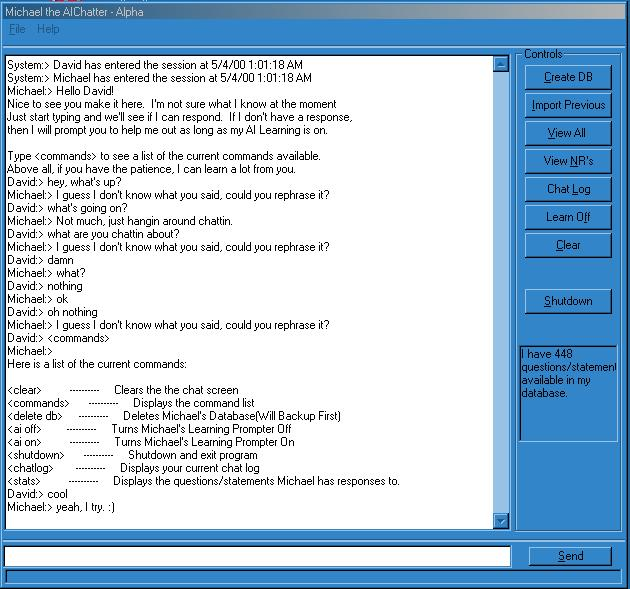



## AIChatter\[Update 1\]

### Description

Here is an update to Michael the AIChatter. He's looking pretty good. Some changes made. Redid the whole thing from scratch. You can now turn off Michael's prompting you for new responses. You can also set up multple variations of sentences for him to respond to. You can also view what questions/statements Michael can respond to during runtime. Anyway, check it out and please let me know what you think. He still has a long way to go. I'll be working on him on and off for quite a while. I hope you enjoy the code. Please rate it for me. Thanks.
 
### More Info
 

             |
---                |---
**Submitted On**   |2000-05-04 01:07:54
**By**             |[Michael Heath](https://github.com/Planet-Source-Code/PSCIndex/blob/master/ByAuthor/michael-heath.md)
**Level**          |Intermediate
**User Rating**    |4.5 (18 globes from 4 users)
**Compatibility**  |VB 5\.0, VB 6\.0
**Category**       |[Complete Applications](https://github.com/Planet-Source-Code/PSCIndex/blob/master/ByCategory/complete-applications__1-27.md)
**World**          |[Visual Basic](https://github.com/Planet-Source-Code/PSCIndex/blob/master/ByWorld/visual-basic.md)
**Archive File**   |[CODE\_UPLOAD5482542000\.zip](https://github.com/Planet-Source-Code/michael-heath-aichatter-update-1__1-7845/archive/master.zip)

